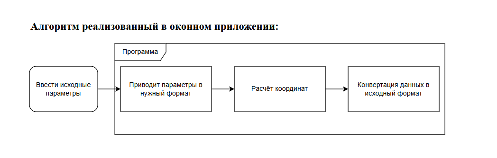
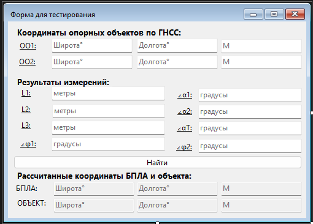
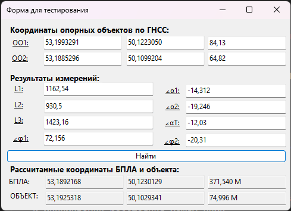

# WindowedCoordinateDetectionWGS84

Библиотека классов C# для триангуляции координат и наземного объекта. Проект включает в себя алгоритмы решения геодезических задач, пересчета координат между различными датумами (WGS-84, ГСК-2011, ПЗ-90.11, СК-42/95) и методы проецирования (Локальной касательной плоскости ).

## Демонстрация работы на конкретном примере

### Исходные координаты оъектов для расчёта

| Название параметра  | Характеристика параметра |
|---------------------|--------------------------|
| Широта ОО1          | 53,1993291 °             |
| Долгота ОО1         | 50,1223050 °             |
| Высота ОО1          | 84,13 М                  |
| Широта ОО2          | 53,1885296 °             |
| Долгота ОО2         | 50,1099204 °             |
| Высота ОО2          | 64,82 М                  |
| Широта Наблюдателя  | 53,1892165 °             |
| Долгота Наблюдателя | 50,1230128 °             |
| Высота Наблюдателя  | 371,53 М                 |
| Широта Объекта      | 53,1925198 °             |
| Долгота Объекта     | 50,1029277 °             |
| Высота Объекта      | 74,9 М                   |

### Исходные данные для расчета

| Название параметра   | Характеристика параметра |
|----------------------|--------------------------|
| Широта ОО1           | 53,1993291 °             |
| Долгота ОО1          | 50,1223050 °             |
| Высота ОО1           | 84,13 М                  |
| Широта ОО2           | 53,1885296 °             |
| Долгота ОО2          | 50,1099204 °             |
| Высота ОО2           | 64,82 М                  |
| L БПЛА-ОО1           | 1162,54 М                |
| L БПЛА-ОО2           | 930,5 М                  |
| L БПЛА-ЦЕЛЬ          | 1423,16 М                |
| Азимут Цель-БПЛА-ОО1 | 72,156 °                 |
| Азимут Цель-БПЛА-ОО2 | -20,31 °                 |
| Угол места ОО1       | -14,312 °                |
| Угол места ОО2       | -19,246 °                |
| Угол места Цель      | -12,03 °                 |

### Работоспособность оконного приложения

>     
> **Рисунок 1:** Схема взаимодействия.

>     
> **Рисунок 2:** Интерфейс программы для ввода исходных данных (координаты наблюдателей, дальности, углы) и отображения результатов.

>     
> **Рисунок 3:** Процесс вычисления координат. Найденная позиция наблюдателя и рассчитанный объект. В таблице результатов отображаются координаты в различных системе (WGS-84).

## Описание ключевых файлов

Проект состоит из двух основных файлов, реализующих всю математическую и геодезическую логику.

### 1. `TargetLocator.cs` - Триангуляция цели

Это ядро алгоритма. Класс `TargetLocator` содержит статические методы для решения основной задачи: определения координат наблюдателя и цели по данным с двух пунктов наблюдения.

*   **`GetTargetCoordinates()`**: Основной метод. На основе наклонных дальностей (L1, L2, L3) и углов (азимутальных `a`, `b` и углов места `aa`, `bb`, `cc`) выполняет:
    1.  Расчет высоты наблюдателя (H) относительно первого опорного объекта.
    2.  Нахождение планового положения наблюдателя через пересечение двух окружностей (проекций дальностей `l1` и `l2`). Для разрешения неоднозначности используется разность углов `a` и `b`.
    3.  Определение возможных координат цели путем решения системы окружностей.
    4.  Выбор наилучшего решения путем усреднения всех возможных комбинаций и минимизации расстояния между ними.
*   **`GetTargetCoordinatesAlternative()`**: Альтернативный метод, использующий векторную алгебру (поворот векторов от наблюдателя к наблюдателям на заданные углы). Результат усредняется для повышения точности. (В оконном риложении не используется)
*   **`FindCircleIntersection()`**: Вспомогательный метод, находящий точки пересечения двух окружностей на плоскости. Содержит все необходимые проверки (окружности не пересекаются, одна внутри другой, совпадают).

### 2. `TranslationWGS84.cs` - Пересчет геодезических координат

Класс `TranslationWGS84` предоставляет полный набор инструментов для работы с различными системами координат, основанный на ГОСТ 32453-2017.

*   **`EncodingDatum`**: Перечисление поддерживаемых геодезических датумов (WGS-84, ГСК-2011, ПЗ-90.11, СК).
*   **Преобразование Геодезических <=> Декартовых координат**: Методы `ConvertGeodeticToCartesian` и `ConvertCartesianToGeodetic` для перевода между широтой/долготой (B, L) и геоцентрическими координатами (X, Y, Z) для любого из поддерживаемых эллипсоидов.
*   **Пересчет между датумами**: Набор методов для точного перехода между системами координат:
    *   `ConvertPZ90ToWGS84` / `ConvertWGS84ToPZ90`
    *   `ConvertPZ90ToGSK2011` / `ConvertGSK2011ToPZ90`
    *   `ConvertPZ90ToSK` / `ConvertSKToPZ90`
*   **Проекция Гаусса-Крюгера**: Методы `ConvertToGaussKrueger` и `ConvertFromGaussKrueger` для перевода координат из геодефических WGS-84 в плоские прямоугольные координаты (зональная система, эллипсоид Красовского) и обратно. Это критически важно для работы в системах, использующих классические топографические карты.
*   **`ConvertGeodeticToLocalTangent`** — перевод геодезических координат (WGS-84) в локальную топоцентрическую систему координат «Восток-Север-Вверх» (East-North-Up) относительно заданной опорной точки.
*   **`ConvertLocalTangentToGeodetic`** — обратное преобразование.

## Технические детали

*   **Язык:** C#
*   **Тип проекта:** Библиотека классов (может быть использована в любом .NET приложении, включая WinForms)
*   **Основные стандарты:** Реализации опираются на геодезические стандарты (параметры эллипсоидов, формулы пересчета).